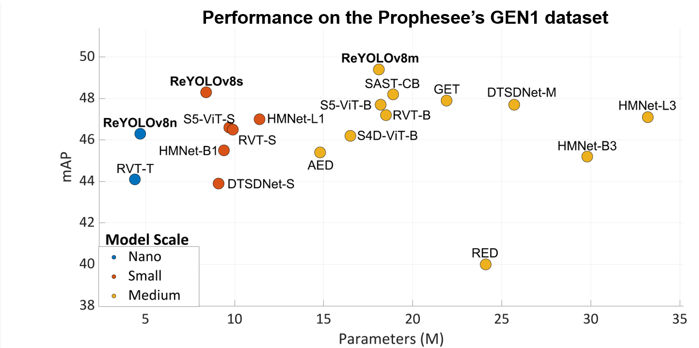

# ReYOLOv8

This repository contains the source code for "A Recurrent YOLOv8-Based Framework for Event-Based Object Detection", accepted for publication in the Frontiers of Neuroscience journal under the Neuromorphic Engineering topic. <br/>




You can read the full paper on: <br/>
[Arxiv version of ReYOLOv8 paper](https://arxiv.org/pdf/2408.05321) <br/>

To check-out the original YOLOv8 repo, from Utralytics, you can check: <br/>
[Ultralytics' original repo](https://github.com/ultralytics/ultralytics) <br/>

# Setting up the environment 
```
conda create -n reyolov8 python==3.9
conda activate reyolov8 
conda install pytorch==1.12.1 torchvision==0.13.1 torchaudio==0.12.1 cudatoolkit=11.6 -c pytorch -c conda-forge 
python -m pip install opencv-python tqdm==4.66.2 pandas==2.2.2 numpy==1.22.4 psutil==5.9.8 pyyaml==6.0.1 matplotlib==3.8.4 thop wandb h5py==3.11.0 hdf5plugin==4.4.0 tensorboard==2.16.2 
```
# Downloading the necessary data

You can donwload the pretrained weights used in this work here:

[pretrained weights](https://drive.google.com/drive/folders/1UHIShRPFNVq1hDIUDlWC2gCz-RAbidr7?usp=drive_link)

Meanwhile, the preprocessed datasets can be found here:

[preprocessed datasets](https://drive.google.com/drive/folders/1mmzEw8Jkcz9BFocw5OqFdCLb_H8t-ue5?usp=drive_link)
# Evaluate the results of the paper

First of all, you need to open the "yaml" file to the corresponding dataset you want to test and modify the paths to the location you are using.
Then, you can run:

```
 python val.py --data ${DATASET}.yaml --model ${WEIGHTS}.pt --channels 5 --split ${SPLIT}
```
Example
**${SPLIT}**: val, test
**${DATASET}**: vtei_gen1, vtei_pedro
**${WEIGHTS}**: weights/reyolov8s_gen1_rps

The speed statistics in this validation mode are given according the full sequences. To check the speed to perform inference tensor by tensor, we run:

```
 python val.py --data ${DATASET}.yaml --model ${WEIGHTS}.pt --channels 5 --split ${SPLIT} --speed
```

To evaluate the data format statistics

```
 python EventEncodingProfiler.py --folder "test_timing"
```

The folder **${test_timing}** has the "csv" files resulting from our experiments. 

To generate the csv files on your own setup, you can first download the sequence used for us through this link:
[Sequence for data format evaluation](https://drive.google.com/file/d/1Tuey6YnQsouGtM1bFNKk2WCRAGrsh1xM/view?usp=sharing)

Then, you can generate the csv files running the following snippet of code 

```
python EventEncodingProfilerRun.py --input_file $DAT --output $OUTPUT_FOLDER --format $FMT

```

where

**${AEDAT4}**: the DAT file used for eveluation
**${OUTPUT_FOLDER}**: the folder where you want to save it
**${FMT}**: vtei, mdes, voxel_grid, or shist

Then, after running this snippet for all the formats, you can run the **{EventEncodingProfiler.py}** file again

# Training 

**Single-GPU**

```
python train.py --batch 12 --nbs 6 --epochs 100 --data ${DATASET}.yaml  --model ${MODEL_NAME}.yaml --channels 5 --name ${WANDB_RUN_NAME} --project ${WANDB_PROJECT_NAME} 
```

# Raw Datasets 

The raw datasets used in this work can be found on the following links:

- **GEN1**: [Prophesee Gen1 Automotive Detection Dataset](https://www.prophesee.ai/2020/01/24/prophesee-gen1-automotive-detection-dataset/)
- **PEDRo**: [PEDRo Event-Based Dataset](https://github.com/SSIGPRO/PEDRo-Event-Based-Dataset)

# Code Acknowledgements

- https://github.com/ultralytics/ultralytics
- https://github.com/MichiganCOG/vip
- https://github.com/uzh-rpg/RVT
